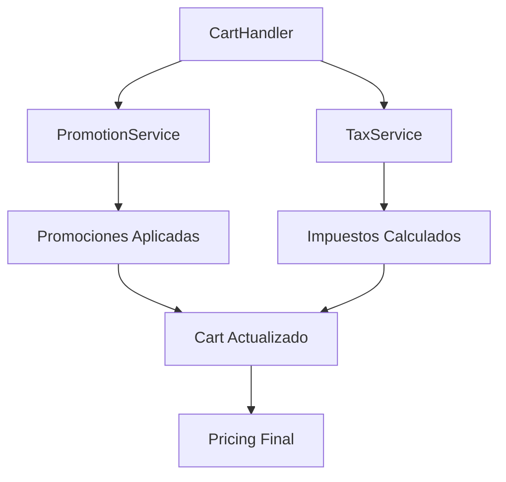

# Cart Library

Una librería completa para el manejo de carritos de compras con soporte para promociones, impuestos y validaciones.

## 📋 Tabla de Contenidos

- [Instalación](#instalación)
- [Uso Básico](#uso-básico)
- [Arquitectura](#arquitectura)
- [Servicios](#servicios)
- [Tipos](#tipos)
- [Ejemplos](#ejemplos)
- [API Reference](#api-reference)

## 🚀 Instalación

```typescript
import { CartHandler } from './cart-lib/cart-handler';
import { PromotionService, TaxService } from './cart-lib/services';
import type { Cart, CartProduct, CartConfiguration } from './cart-lib/types';
```

## 💡 Uso Básico

### Crear un CartHandler

```typescript
import { CartHandler } from './cart-lib/cart-handler';

const cart: Cart = {
  _id: 'cart-123',
  createdAt: new Date(),
  updatedAt: new Date(),
  domain: 'mi-tienda.com',
  cartProducts: [],
  pricing: {
    totalPrice: 0,
    finalTotalPrice: 0,
  },
  sellerDiscount: 0,
};

const configuration: CartConfiguration = {
  maxItems: 50,
  minOrderValue: 10,
  showTaxedPrice: true,
};

const cartHandler = new CartHandler(cart, [], configuration);
```

### Agregar Productos

```typescript
const product: CartProduct = {
  product: {
    id: 'product-123',
    name: 'Smartphone',
    brand: 'TechBrand',
    pricing: {
      pricePerUnit: 299.99,
      discountType: null,
      steps: [],
    },
    taxes: [
      {
        taxCode: 'VAT',
        taxName: 'IVA',
        taxRate: 0.19,
      },
    ],
  },
  quantity: 2,
  multiplier: 1,
  sellerDiscount: 0,
  appliedDiscounts: [],
  steps: [],
};

const updatedCart = cartHandler.addProduct(product);
```

## 🏗️ Arquitectura

```
cart-lib/
├── cart-handler.ts          # Clase principal para manejo del carrito
├── services/
│   ├── promotion.service.ts  # Servicio de promociones
│   ├── tax.service.ts       # Servicio de impuestos
│   └── index.ts            # Exportaciones de servicios
├── types/
│   ├── cart/               # Tipos relacionados al carrito
│   ├── taxes/              # Tipos relacionados a impuestos
│   └── index.ts           # Exportaciones de tipos
└── __tests__/             # Tests unitarios
```

## 🔧 Servicios

### CartHandler

Clase principal que maneja todas las operaciones del carrito:

- ✅ Agregar/eliminar productos
- ✅ Modificar cantidades
- ✅ Aplicar promociones automáticamente
- ✅ Calcular impuestos
- ✅ Validar orden
- ✅ Aplicar cupones

### PromotionService

Maneja el cálculo y aplicación de promociones:

- ✅ Promociones regulares (porcentaje/fijo)
- ✅ Promociones escalonadas (Step/MixedStep)
- ✅ Promociones de regalo (Gift)
- ✅ Aplicación de cupones

### TaxService

Calcula y aplica impuestos:

- ✅ Impuestos por producto
- ✅ Impuestos escalonados
- ✅ Totales con impuestos
- ✅ Recálculo después de cupones

## 📊 Tipos Principales

### Cart

```typescript
type Cart = {
  _id: string;
  createdAt: Date;
  updatedAt: Date;
  commerceId?: string;
  customerId?: string;
  guestId?: string;
  domain: string;
  cartProducts: CartProduct[];
  pricing: Pricing;
  sellerDiscount: number;
};
```

### CartProduct

```typescript
type CartProduct = {
  product: Product;
  quantity: number;
  multiplier: number;
  sellerDiscount: number;
  appliedDiscounts: PromotionRules[];
  steps: Steps[];
};
```

### CartConfiguration

```typescript
type CartConfiguration = {
  maxItems: number;
  minOrderValue: number;
  showTaxedPrice?: boolean;
  disableCart?: boolean;
  maintenanceMode?: boolean;
};
```

## 🎯 Ejemplos

### Ejemplo Completo: E-commerce

```typescript
const cartHandler = new CartHandler(emptyCart, availableDiscounts, config);

cartHandler.addProduct({
  product: smartphone,
  quantity: 1,
  multiplier: 1,
  sellerDiscount: 0,
  appliedDiscounts: [],
  steps: [],
});

cartHandler.addProduct({
  product: headphones,
  quantity: 2,
  multiplier: 1,
  sellerDiscount: 10, // Descuento del vendedor
  appliedDiscounts: [],
  steps: [],
});

const couponResult = cartHandler.applyCoupon({
  id: 'SAVE20',
  code: 'SAVE20',
  type: 'percentage',
  discountValue: 20,
});

const taxSummary = cartHandler.getTaxSummary();
const savingsSummary = cartHandler.getSavingsSummary();
const promotions = cartHandler.getAppliedPromotions();

const errors = cartHandler.validateOrder();
if (errors.length === 0) {
  console.log('Carrito válido para checkout');
} else {
  console.log('Errores:', errors);
}
```

### Ejemplo: Manejo de Impuestos

```typescript
const taxService = new TaxService();

const productsWithTaxes = taxService.processPromotionsResults(cartProducts, availableTaxCodes);

const cartTotals = taxService.calculateCartTotal(productsWithTaxes);

console.log(`Subtotal: $${cartTotals.totalNetTaxedPrice}`);
console.log(`Impuestos: $${cartTotals.totalTaxAmount}`);
console.log(`Total: $${cartTotals.totalFinalPrice}`);
```

### Ejemplo: Promociones Personalizadas

```typescript
const promotionService = new PromotionService();

const promotionResult = promotionService.calculatePromotions(cartProducts, availableDiscounts);

const couponResult = promotionService.applyCoupon(cartProducts, {
  id: 'WELCOME10',
  code: 'WELCOME10',
  type: 'percentage',
  discountValue: 10,
});
```

## 📚 API Reference

### CartHandler Methods

| Método                    | Descripción                     | Parámetros                                              | Retorno                                            |
| ------------------------- | ------------------------------- | ------------------------------------------------------- | -------------------------------------------------- |
| `addProduct()`            | Agrega producto al carrito      | `product: CartProduct, coupon?: ICoupon`                | `Cart`                                             |
| `deleteProduct()`         | Elimina producto del carrito    | `productId: string`                                     | `Cart`                                             |
| `modifyProduct()`         | Modifica cantidad de producto   | `productId: string, quantity: number, coupon?: ICoupon` | `Cart`                                             |
| `deleteCart()`            | Limpia todos los productos      | -                                                       | `Cart`                                             |
| `applyCoupon()`           | Aplica cupón al carrito         | `coupon: ICoupon & IDiscountBase`                       | `{success: boolean, cart?: Cart, reason?: string}` |
| `validateOrder()`         | Valida el carrito para checkout | -                                                       | `string[]`                                         |
| `validateInternalState()` | Valida consistencia interna     | -                                                       | `string[]`                                         |
| `getAppliedPromotions()`  | Obtiene promociones aplicadas   | -                                                       | `PromotionApplierResponse \| undefined`            |
| `getAppliedTaxes()`       | Obtiene impuestos aplicados     | -                                                       | `CartTaxes \| undefined`                           |
| `refreshPromotions()`     | Recalcula promociones           | `coupon?: ICoupon`                                      | `void`                                             |

### TaxService Methods

| Método                       | Descripción                       | Parámetros                                                  | Retorno         |
| ---------------------------- | --------------------------------- | ----------------------------------------------------------- | --------------- |
| `applyTaxes()`               | Aplica impuestos a un precio      | `taxes: TaxCode[], price: number`                           | `TaxResult`     |
| `processPromotionsResults()` | Procesa productos con promociones | `cartProducts: CartProduct[], availableTaxCodes: TaxCode[]` | `CartProduct[]` |
| `calculateCartTotal()`       | Calcula totales del carrito       | `cartProducts: CartProduct[]`                               | `CartTaxes`     |
| `getTaxSummary()`            | Obtiene resumen de impuestos      | `cartTaxes: CartTaxes`                                      | `TaxSummary`    |

### PromotionService Methods

| Método                  | Descripción                     | Parámetros                                                         | Retorno                    |
| ----------------------- | ------------------------------- | ------------------------------------------------------------------ | -------------------------- |
| `calculatePromotions()` | Calcula promociones automáticas | `cartProducts: CartProduct[], availableDiscounts: IDiscountBase[]` | `PromotionApplierResponse` |
| `applyCoupon()`         | Aplica cupón específico         | `products: CartProduct[], coupon: ICoupon & IDiscountBase`         | `PromotionApplierResponse` |

## 🧪 Testing

La librería incluye tests unitarios completos:

```bash
# Ejecutar tests del cart-lib
npm test -- --testPathPattern="cart-lib"

# Ejecutar tests específicos
npm test -- cart-handler.test.ts
npm test -- tax.service.test.ts
npm test -- cart-promotion.service.test.ts
```

## 🔄 Flujo de Datos



## 🚨 Validaciones

El sistema incluye validaciones automáticas robustas:

### Validaciones de Configuración

- ✅ Máximo de productos por carrito (con límites de performance)
- ✅ Valor mínimo de orden (con validación de rangos)
- ✅ Tipos de datos correctos (boolean, number, integer)
- ✅ Rangos razonables para evitar problemas de performance

### Validaciones de Negocio

- ✅ Productos válidos con datos requeridos
- ✅ Cantidades positivas y enteras
- ✅ Precios no negativos
- ✅ Descuentos de vendedor en rango válido (0-100%)
- ✅ Límites de compra por producto
- ✅ Consistencia de estado interno
- ✅ Totales coherentes

### Validaciones de Entrada

- ✅ Parámetros requeridos presentes
- ✅ IDs de productos válidos
- ✅ Cantidades dentro de límites configurados
- ✅ Estructura de datos correcta

## 🔧 Configuración

### CartConfiguration

```typescript
const config: CartConfiguration = {
  maxItems: 100, // Máximo 100 productos diferentes
  minOrderValue: 25, // Orden mínima de $25
  showTaxedPrice: true, // Mostrar precios con impuestos
  disableCart: false, // Carrito habilitado
  maintenanceMode: false, // Modo mantenimiento deshabilitado
};
```

## 📈 Performance y Arquitectura

### Características de Performance

- ✅ **Operaciones síncronas** - Cálculos inmediatos sin latencia de I/O
- ✅ **Inmutabilidad completa** - Sin side effects, thread-safe
- ✅ **Validaciones eficientes** - Detección temprana de errores
- ✅ **Mapeo seguro** - Acceso protegido a arrays y propiedades opcionales
- ✅ **Error handling robusto** - Contexto detallado para debugging

### Recomendaciones de Cache

Para aplicaciones de alta concurrencia, se recomienda implementar cache a nivel de aplicación:

```typescript
@Injectable()
export class CartService {
  async getCartWithCalculations(cartId: string): Promise<Cart> {
    const cached = await this.redis.get(`cart:${cartId}`);
    if (cached) return cached;

    const cart = await this.getCart(cartId);
    const handler = new CartHandler(cart, discounts, config);
    const result = handler.getCart();

    await this.redis.setex(`cart:${cartId}`, 300, result);
    return result;
  }
}
```

### Thread Safety

- ✅ **Completamente thread-safe** - Todas las operaciones son inmutables
- ✅ **Sin race conditions** - No hay estado compartido mutable
- ✅ **Operaciones atómicas** - Cada método retorna un nuevo estado

## 🚀 Mejoras Recientes

### v2.0 - Refactoring Completo (2024)

#### ✅ Problemas Críticos Resueltos

- **Inmutabilidad completa** - Eliminación de mutaciones directas del estado
- **Thread safety** - Operaciones seguras para entornos concurrentes
- **Mapeo robusto** - Acceso seguro a arrays y propiedades opcionales
- **Configuración flexible** - Eliminación de valores hardcoded
- **Optimización de cupones** - Eliminación de doble recálculo

#### ✅ Validaciones Mejoradas

- **Validación de configuración expandida** - Rangos, tipos, límites de performance
- **Business rules validation** - Validaciones de negocio completas
- **Error handling robusto** - Contexto detallado y mensajes informativos
- **Validación de entrada** - Verificación completa de parámetros

#### ✅ Arquitectura Simplificada

- **Cache externo recomendado** - Eliminación de cache programático interno
- **Operaciones síncronas** - Consistencia entre interfaces y implementación
- **Responsabilidad única** - Enfoque en lógica de negocio del carrito

## 🤝 Contribución

Para contribuir al cart-lib:

1. Mantén la compatibilidad con tipos existentes
2. Agrega tests para nuevas funcionalidades
3. Documenta cambios en la API
4. Sigue las convenciones de naming establecidas
5. Asegúrate de que todas las operaciones sean inmutables
6. Incluye validaciones robustas para nuevas funcionalidades

## 📄 Licencia

Este módulo es parte del sistema de órdenes y sigue la misma licencia del proyecto principal.
